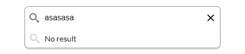
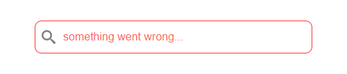

<h1 align="center">
  autosuggest/autocomplete
</h1>

<p align="center">
  Simple autosuggest/autocomplete with asynchronous data fetch
</p>

<p align="center">
  
  <a href="LICENSE">
    
  </a>
</p>

<p align="center">
  
</p>

## Demo
See the demo - [example](https://tomik23.github.io/autosuggest/)

## Features
- Accessible, with full support for ARIA attributes and keyboard interactions.
- Customize your own CSS.
- Support for asynchronous data fetching.
- Move between the records using the arrows <kbd>↓</kbd> <kbd>↑</kbd>, and confirm by <kbd>Enter</kbd>
- No dependencies

## Initialization
Before the first use, clone this repository and install node dependencies:

```js
yarn
// or 
npm install
```

## Run the app
Run the app, just call:

```js
yarn dev
// or
npm run dev
```

The final code:

```js
yarn prod
```

## Configuration of the plugin

props | type | default | require | description
---- | :----: | :-------: | :--------: | -----------
element | String |  | ✔ | Input field id
htmlTemplate | Function |  | ✔ | Function that creates the appearance of the result
dataAPI/path | String |   | ✔ | Path to our Rest API or static file
dataAPI/searchLike | Boolean | `false` |  | The `true` parameter controls whether we append the search text to the URL `http://localhost:3005/persons?like=search-text`
clearButton | Boolean | `false` |  | The parameter set to `true` adds a button to delete the text from the input field, a small `x` to the right of the input field 
placeholderError | String | `something went wrong...`  |  | Adding plaseholder
noResult | String | `No result`  |  | Adding plaseholder
delay | Number | `500` |  | Delay without which the server would not survive ;)
howManyCharacters | Number | `1` |  | The number of characters entered should start searching
onSubmit | Function |  |  | Executed on input submission

## Usage

HMTL
```html
<div class="search">
  <input type="text" id="search" class="full-width" autocomplete="off" placeholder="Enter letter">
</div>
```

JAVASCRIPT
```js
const options = {
  
  // search delay
  delay: 1000,
  
  // how many characters to search
  howManyCharacters: 1,
  
  // text when an error occurs
  placeholderError: 'something went wrong...',
  
  // add button 'x' to clear the text from
  // the input filed
  clearButton: true,
  
  // setting this parameter causes no result 
  // when there are no results
  noResult: 'No result',
  dataAPI: {
    
    // controlling the way data is downloaded
    searchLike: true,
  
    // static file or dynamic address
    path: process.env.ASSET_PATH,
  },

  // this part is responsible for the number of records,
  // the appearance of li elements and it really depends
  // on you how it will look
  htmlTemplate: function (matches) {
    const regex = new RegExp(`${matches[0]}`, 'gi');
    const html = matches.slice(1)
      .filter((element, index) => {
        return element.name.match(regex);
      })
      .sort((a, b) => a.name.localeCompare(b.name))
      .map(el => {

        // this part is responsible for the appearance 
        // in the drop-down list - see the example in index.html
        // remember only the first element from <li> is put 
        // into the input field, in this case the text
        // from the <p> element
        return `
          <li class="autocomplete-item loupe" role="option" aria-selected="false" tabindex="-1">
            <p>${el.name.replace(regex, (str) => `<b>${str}</b>`)}</p>
          </li>`;
      });
      return html.join('');
  },

  // the onSubmit function is executed when the user 
  // submits their result by either selecting a result
  // from the list, or pressing enter or mouse button
  
  onSubmit: (matches) => {
    console.log(`You selected ${matches}`);
    // you can open a window or do a redirect
    // window.open(`https://en.wikipedia.org/wiki/${encodeURI(matches)}`);
  }
}

// `element` this is the id of the input field
new Autosuggest('element', options);
```

## Add your own result template `htmlTemplate`

In fact, we can work on dynamic data or static files. Data can be in the form of an array or json. It's up to you what the results list will look like. You can configure everything yourself using the `htmlTemplate` method


## htmlTemplate example

```js
...
htmlTemplate: function (matches) {
  const regex = new RegExp(`${matches[0]}`, 'gi');
  const html = matches.slice(1)
    .filter((element, index) => {
      return element.name.match(regex);
    })
    .sort((a, b) => a.name.localeCompare(b.name))
    .map(el => {
      return `
        <li class="autocomplete-item loupe" role="option" aria-selected="false" tabindex="-1">
          <p>${el.name.replace(regex, (str) => `<b>${str}</b>`)}</p>
        </li>`;
    });
  return html.join('');
}

```

## Minimal config
Download from `docs` folder:
- autosuggest.min.css
- autosuggest.min.js
- global.min.css

CSS
```html
<link rel="stylesheet" href="global.min.css">
<link rel="stylesheet" href="autosuggest.min.css">
```

HTML
```html
<div class="search">
  <input type="text" id="search" class="full-width" autocomplete="off" placeholder="Enter letter">
</div>
```
JavaScript
```js
window.addEventListener('DOMContentLoaded', function () {
  new Autosuggest('search', {
    dataAPI: {
      path: process.env.ASSET_PATH, // static file or dynamic api
    },
    htmlTemplate: function (matches) {
      const regex = new RegExp(`${matches[0]}`, 'gi');
      const html = matches.slice(1)
        .filter((element, index) => {
          return element.name.match(regex);
        })
        .sort((a, b) => a.name.localeCompare(b.name))
        .map(el => {
          return `
            <li class="autocomplete-item loupe" role="option" aria-selected="false" tabindex="-1">
              <p>${el.name.replace(regex, (str) => `<b>${str}</b>`)}</p>
            </li>`;
        }).join('');
    }
  });
});

<script src="autosuggest.min.js"></script>

```
## Browsers support

| [](http://godban.github.io/browsers-support-badges/)<br/>IE / Edge | [](http://godban.github.io/browsers-support-badges/)<br/>Firefox | [](http://godban.github.io/browsers-support-badges/)<br/>Chrome | [](http://godban.github.io/browsers-support-badges/)<br/>Opera | [](http://godban.github.io/browsers-support-badges/)<br/>Vivaldi |
| --------- | --------- | --------- | --------- | --------- |
| IE10, IE11, Edge| last 2 versions| last 2 versions| last 2 versions| last 2 versions

### IE10, IE11

Will work if you use polyfill for promise.
There are three ways to add this polyfill:

1. Add the following script to your html
```html
<script type="text/javascript">
  if (!('Promise' in window)) {
    var script = document.createElement("script");
    script.src = "https://polyfill.io/v3/polyfill.min.js?features=Promise";
    document.getElementsByTagName('head')[0].appendChild(script);
  }
</script>
```

2. Add the script below to head in html 
```html
<script src="https://cdn.jsdelivr.net/npm/promise-polyfill@8/dist/polyfill.min.js"></script>
```

3. Add pollyfill to Autosuggest.js and build the script again 
```javascript
import 'promise-polyfill/src/polyfill';
```

## More appearance examples

<div align="center">No result</div>
<p align="center">
  
</p>

<div align="center">More complicated results</div>
<p align="center">
  
</p>

<div align="center">Error</div>
<p align="center">
  
</p>


## License
This project is available under the [MIT](https://opensource.org/licenses/mit-license.php) license.  