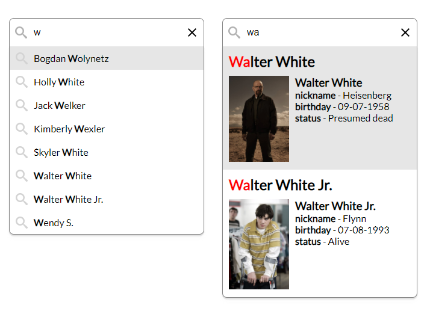

<h1 align="center">
  autocomplete
</h1>

<p align="center">
  Simple autocomplete with asynchronous data fetch
</p>

<p align="center">
  
  
  <a href="LICENSE">
    
  </a>
</p>

<p align="center">
  
</p>

## Demo

See the demo - [example](https://tomik23.github.io/autocomplete/)

## Features

- You're in full control of the DOM elements to output
- Accessible, with full support for ARIA attributes and keyboard interactions
- Customize your own CSS
- Support for asynchronous data fetching
- Move between the records using the arrows <kbd>↓</kbd> <kbd>↑</kbd>, and confirm by <kbd>Enter</kbd> or mouse
- Grouping of record results
- Showing 'no results'
- Show all values on click
- Multiple choices
- No dependencies
- Very light library, packed gzip **only ~3KB**
- And a lot more

## Installation

### CDN

#### CSS

```html
<link rel="stylesheet" href="https://cdn.jsdelivr.net/gh/tomik23/autocomplete@1.8.6/dist/css/autocomplete.min.css"/>
```

#### JavaScript

```html
<script src="https://cdn.jsdelivr.net/gh/tomik23/autocomplete@1.8.6/dist/js/autocomplete.min.js"></script>
```

##### -- OR --

Download from `dist` folder and insert to html:

- dist/css/autocomplete.css
- dist/js/autocomplete.min.js

#### HTML

Basic code to display autocomplete correctly

```html
<div class="auto-search-wrapper">
  <input type="text" id="local" autocomplete="off" placeholder="Enter letter" />
</div>
```

#### JavaScript

```js
window.addEventListener('DOMContentLoaded', function () {
  // 'local' is the 'id' of input element
  new Autocomplete('local', {
    onSearch: ({ currentValue }) => {
      // local data
      const data = [
        { name: 'Walter White' },
        { name: 'Jesse Pinkman' },
        { name: 'Skyler White' },
        { name: 'Walter White Jr.' },
      ];
      return data
        .sort((a, b) => a.name.localeCompare(b.name))
        .filter((element) => {
          return element.name.match(new RegExp(currentValue, 'i'));
        });
    },

    onResults: ({ matches }) => {
      return matches
        .map((el) => {
          return `
            <li>${el.name}</li>`;
        })
        .join('');
    },
  });
});
```

## Package Manager

Before the first use, clone this repository and install node dependencies:

```js
git clone https://github.com/tomik23/autocomplete.git

yarn
// or
npm install
```

## Run the app

Run the development version:

```js
yarn dev
// or
npm run dev
```

Run the production version:

```js
yarn prod
// or
npm run prod
```

## Configuration of the plugin

| props                |    type    |               default               | require | description                                                                                                                                                              |
| -------------------- | :--------: | :---------------------------------: | :-----: | ------------------------------------------------------------------------------------------------------------------------------------------------------------------------ |
| element              |   string   |                                     |    ✔    | Input field id                                                                                                                                                           |
| onSearch             |  function  |                                     |    ✔    | Function for user input. It can be a synchronous function or a promise                                                                                                   |
| onResults            |  function  |                                     |    ✔    | Function that creates the appearance of the result                                                                                                                       |
| onSubmit             |  function  |                                     |         | Executed on input submission                                                                                                                                             |
| onOpened             |  function  |                                     |         | returns two variables 'results' and 'showItems', 'resutls' first rendering of the results 'showItems' only showing the results when clicking on the input field          |
| onSelectedItem       |  function  |                                     |         | Get index and data from li element after hovering over li with the mouse or using arrow keys ↓/↑                                                                         |
| onReset              |  function  |                                     |         | After clicking the 'x' button                                                                                                                                            |
| onRender             |  function  |                                     |         | Possibility to add html elements, e.g. before and after the search results                                                                                               |
| onClose              |  function  |                                     |         | e.g. delete class after close results, see example modal                                                                                                                 |
| noResults            |  function  |                                     |         | Showing information: "no results"                                                                                                                                        |
| destroy              |   method   |                                     |         | Removes the autocomplete instance and its bindings                                                                                                                       |
| clearButton          |  boolean   |               `true`                |         | A parameter set to 'true' adds a button to remove text from the input field                                                                                              |
| clearButtonOnInitial |  boolean   |               `false`               |         | A parameter set to 'true' adds a button to remove text from the input field visible on initial Autocomplete lib.                                                         |
| selectFirst          |  boolean   |               `false`               |         | Default selects the first item in the list of results                                                                                                                    |
| insertToInput        |  boolean   |               `false`               |         | Adding an element selected with arrows to the input field                                                                                                                |
| disableCloseOnSelect |  boolean   |               `false`               |         | Prevents results from hiding after clicking on an item from the results list                                                                                             |
| showAllValues        |  boolean   |               `false`               |         | This option will toggle showing all values when the input is clicked, like a default dropdown                                                                            |
| cache                |  boolean   |               `false`               |         | The characters entered in the input field are cached                                                                                                                     |
| howManyCharacters    |   number   |                 `1`                 |         | The number of characters entered should start searching                                                                                                                  |
| delay                |   number   |                `500`                |         | Time in milliseconds that the component should wait after last keystroke before calling search function 1000 = 1s                                                        |
| ariaLabelClear       |   string   |        `clear the search query.`      |         | Set aria-label attribute for the clear button |
| classPreventClosing  |   string   |                                     |         | Prevents results from hiding after clicking on element with this class                                                                                                   |
| classGroup           |   string   |                                     |         | Enter a class name, this class will be added to the group name elements                                                                                                  |
| classPrefix          |   string   |                                     |         | Prefixing all autocomplete css class name, 'prefix-auto-', default 'auto-'                                                                                               |
| ~~instruction~~      | ~~string~~ | ~~`When autocomplete results ...`~~ |         | ~~aria-describedby [attribute](https://developer.mozilla.org/en-US/docs/Web/Accessibility/ARIA/ARIA_Techniques/Using_the_aria-describedby_attribute) A full text below~~ |

**instructions** - has been removed from the library, [see how to add to html](https://tomik23.github.io/autocomplete/#complex-example)

## How do I add data to the input field?

### Simple data

```js
onResults: ({ matches }) => {
  return matches
    .map((el) => {
      return `
        <li>${el.name}</li>`;
    })
    .join('');
};
```

### A complicated example

The example below displays `${el.name}`, first name and last name as well as `${el.img}` photo in the results. From this example, only the first element will be added to the input field. So `${el.name}` no matter if it will be inside `p`, `div`, `span` etc. Always the first element and it's only text so it can even be in this form `<p><b>${el.name}</b></p>`

```js
onResults: ({ matches }) => {
  return matches
    .map((el) => {
      return `
        <li>
          <p>${el.name}</p>
          <p></p>
        </li>`;
    })
    .join('');
};
```

## Usage jquery || axios || promise + fetch

JAVASCRIPT

```js
new Autocomplete('complex', {
  // search delay
  delay: 1000,

  // add button 'x' to clear the text from
  // the input filed
  // by default is true
  clearButton: false,

  // show button 'x' to clear the text from
  // the input filed on initial library
  clearButtonOnInitial: false,

  // default selects the first item in
  // the list of results
  // by default is false
  selectFirst: true,

  // add text to the input field as you move through
  // the results with the up/down cursors
  // by default is false
  insertToInput: true,

  // the number of characters entered
  // should start searching
  // by default is 1
  howManyCharacters: 2,

  // the characters entered in
  // the input field are cached
  // by default is false
  cache: true,

  // prevents results from hiding after
  // clicking on an item from the list
  // by default is false
  disableCloseOnSelect: true,

  // enter the name of the class by
  // which you will name the group element
  // by default is empty ''
  classGroup: 'group-by',

  // prevents results from hiding after
  // clicking on element with this class
  // of course, any class name
  // by default is empty ''
  classPreventClosing: 'additional-elements',

  // prefixing all autocomplete css class name,
  // 'prefix-auto-', default 'auto-'
  classPrefix: 'prefix',

  // this option will toggle showing all
  // values when the input is clicked,
  // like a default dropdown
  // by default is false
  showAllValues: true,

  // set aria-label attribute for the clear button
  // by default is 'clear text from input'
  ariaLabelClear: 'insert your text if you want ;)'

  // Function for user input. It can be a synchronous function or a promise
  // you can fetch data with jquery, axios, fetch, etc.
  onSearch: ({ currentValue }) => {
    // static file
    // const api = './characters.json';

    // OR -------------------------------

    // your REST API
    const api = `https://breakingbadapi.com/api/characters?name=${encodeURI(currentValue)}`;
    /**
     * jquery
     * If you want to use jquery you have to add the
     * jquery library to head html
     * https://cdnjs.com/libraries/jquery
     */
    return $.ajax({
      url: api,
      method: 'GET',
    })
      .done(function (data) {
        return data;
      })
      .fail(function (xhr) {
        console.error(xhr);
      });

    // OR ----------------------------------

    /**
     * axios
     * If you want to use axios you have to add the
     * axios library to head html
     * https://cdnjs.com/libraries/axios
     */
    return axios
      .get(api)
      .then((response) => {
        return response.data;
      })
      .catch((error) => {
        console.log(error);
      });

    // OR ----------------------------------

    /**
     * Promise
     */
    return new Promise((resolve) => {
      fetch(api)
        .then((response) => response.json())
        .then((data) => {
          resolve(data);
        })
        .catch((error) => {
          console.error(error);
        });
    });
  },

  // this part is responsible for the number of records,
  // the appearance of li elements and it really depends
  // on you how it will look
  onResults: ({ currentValue, matches, template, classGroup }) => {
    // const regex = new RegExp(^${input}`, 'gi'); // start with
    const regex = new RegExp(currentValue, 'gi');

    // counting status elements
    function count(status) {
      let count = {};
      matches.map((el) => {
        count[el.status] = (count[el.status] || 0) + 1;
      });
      return `<small>${count[status]} items</small>`;
    }

    // checking if we have results if we don't
    // take data from the noResults collback
    return matches === 0
      ? template
      : matches
          .sort(
            (a, b) =>
              a.status.localeCompare(b.status) || a.name.localeCompare(b.name)
          )
          .map((el, index, array) => {
            // we create an element of the group
            let group =
              el.status !== array[index - 1]?.status
                ? `<li class="${classGroup}">${el.status} ${count(el.status)}</li>`
                : '';

            // this part is responsible for the appearance
            // in the drop-down list - see the example in index.html
            // remember only the first element from <li> is put
            // into the input field, in this case the text
            // from the <p> element
            return `
              ${group}
              <li>
                <h2 style="margin-bottom: 10px;">
                  ${el.name.replace(regex, (str) => `<b style="color: red;">${str}</b>`)}
                </h2>
                <div style="display: flex;">
                  <div style="margin-right: 10px;">
                    
                  </div>
                  <div class="info">
                    <h4>${el.name}</h4>
                    <div><b>nickname:</b> - ${el.nickname}</div>
                    <div><b>birthday:</b> - ${el.birthday}</div>
                    <div><b>status:</b> - ${el.status}</div>
                  </div>
                </div>
              </li>`;
          })
          .join('');
  },

  // the onSubmit function is executed when the user
  // submits their result by either selecting a result
  // from the list, or pressing enter or mouse button
  onSubmit: ({ index, element, object, results }) => {
    console.log('complex: ', index, element, object, results);
    // window.open(`https://www.imdb.com/find?q=${encodeURI(input)}`)
  },

  // get index and data from li element after
  // hovering over li with the mouse or using
  // arrow keys ↓ | ↑
  onSelectedItem: ({ index, element, object }) => {
    console.log('onSelectedItem:', index, element.value, object);
  },

  // the calback function presents no results
  noResults: ({ element, currentValue, template }) =>
    template(`<li>No results found: "${currentValue}"</li>`),
});
```

## All available configuration items

```js
const auto = new Autocomplete('you-id', {
  clearButton: true,
  clearButtonOnInitial: false,
  selectFirst: false,
  insertToInput: false,
  disableCloseOnSelect: false,
  cache: false,
  showAllValues: false,
  howManyCharacters: 1,
  delay: 500,
  ariaLabelClear: "clear the search query",
  classPreventClosing: "",
  classGroup: "",
  classPrefix: "auto",
  onSearch: ({ currentValue, element }) => {},
  onResults: ({ currentValue, matches, template, classGroup }) => {},
  onRender: ({ element, results }) => {},
  onSubmit: ({ index, element, object, results }) => {},
  onOpened: ({ type, element, results }) => {},
  onSelectedItem: ({ index, element, object }) => {},
  onReset: (element) => {},
  onClose: () => {},
  noResults: ({ element, currentValue, template }) => {},
});

// public methods
auto.destroy();
```

## Browser support

Autocomplete supports all major browsers including IE 10 and above

Configuration for IE:

### local files
- dist/js/polyfill.js
- dist/js/autocomplete.ie.min.js
- dist/css/autocomplete.ie.min.css

### cdn

- https://cdn.jsdelivr.net/gh/tomik23/autocomplete@1.8.6/dist/js/polyfill.js
- https://cdn.jsdelivr.net/gh/tomik23/autocomplete@1.8.6/dist/js/autocomplete.ie.min.js
- https://cdn.jsdelivr.net/gh/tomik23/autocomplete@1.8.6/dist/css/autocomplete.ie.min.css

### cdn polyfill from npm

- https://cdn.jsdelivr.net/npm/promise-polyfill@8/dist/polyfill.min.js
- https://cdn.jsdelivr.net/npm/element-closest@3.0.2/browser.min.js


## License

This project is available under the [MIT](https://opensource.org/licenses/mit-license.php) license.
