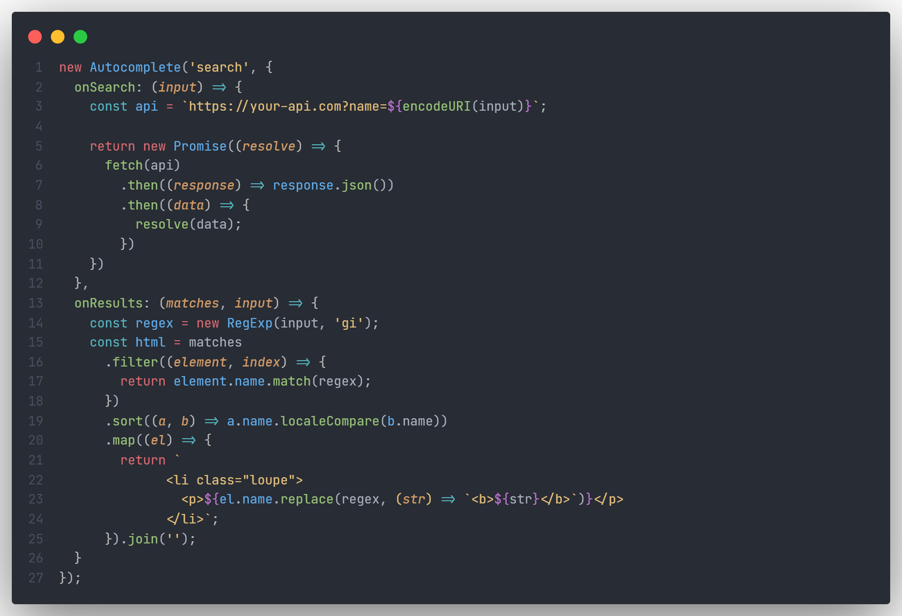
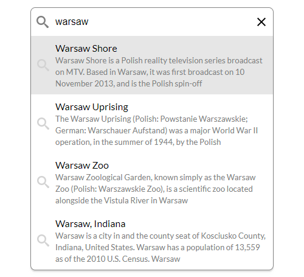

<h1 align="center">
  autosuggest/autocomplete
</h1>

<p align="center">
  Simple autosuggest/autocomplete with asynchronous data fetch
</p>

<p align="center">
  
  
  <a href="LICENSE">
    
  </a>
</p>

<p align="center">
  
</p>

## Demo

See the demo - [example](https://tomik23.github.io/autosuggest/)

## Features

- Accessible, with full support for ARIA attributes and keyboard interactions.
- Customize your own CSS.
- Support for asynchronous data fetching.
- Move between the records using the arrows <kbd>↓</kbd> <kbd>↑</kbd>, and confirm by <kbd>Enter</kbd>
- No dependencies
- Small size library ~9.2KB (gzip ~2.78KB)

## Initialization

Before the first use, clone this repository and install node dependencies:

```js
yarn
// or
npm install
```

## Run the app

Run the app, just call:

```js
yarn dev
// or
npm run dev
```

The final code:

```js
yarn prod
// or
npm run prod
```

## Installation

Download from `docs` folder:

- autosuggest.min.css
- autosuggest.min.js
- global.min.css

CSS

```html
<link rel="stylesheet" href="global.min.css" />
<link rel="stylesheet" href="autosuggest.min.css" />
```

HTML

```html
<div class="search">
  <input
    type="text"
    id="search"
    autocomplete="off"
    placeholder="Enter letter"
  />
</div>
```

JavaScript

```html
<script>
  window.addEventListener('DOMContentLoaded', function () {
    new Autosuggest('search', {
      onSearch: (input) => {
        const api = `https://your-api.com?name=${encodeURI(input)}`;

        return new Promise((resolve) => {
          fetch(api)
            .then((response) => response.json())
            .then((data) => {
              resolve(data);
            });
        });
      },
      onResults: (matches, input) => {
        const regex = new RegExp(input, 'gi');
        const html = matches
          .filter((element, index) => {
            return element.name.match(regex);
          })
          .sort((a, b) => a.name.localeCompare(b.name))
          .map((el) => {
            return `
              <li class="autocomplete-item loupe" role="option" aria-selected="false">
                <p>${el.name.replace(regex, (str) => `<b>${str}</b>`)}</p>
              </li>`;
          })
          .join('');
      },
    });
  });
</script>
<script src="autosuggest.min.js"></script>
```

## Configuration of the plugin

| props             |   type   |             default             | require | description                                                                                                                                                          |
| ----------------- | :------: | :-----------------------------: | :-----: | -------------------------------------------------------------------------------------------------------------------------------------------------------------------- |
| element           |  String  |                                 |    ✔    | Input field id                                                                                                                                                       |
| onSearch          | Function |                                 |    ✔    | Function for user input. It can be a synchronous function or a promise                                                                                               |
| onResults         | Function |                                 |    ✔    | Function that creates the appearance of the result                                                                                                                   |
| onSubmit          | Function |                                 |         | Executed on input submission                                                                                                                                         |
| selectFirst       | Boolean  |             `false`             |         | Default selects the first item in the list of results                                                                                                                |
| scrollIntoView    | Boolean  |             `false`             |         | The scroll of the results follows the selected item when using the up/down arrows                                                                                    |
| clearButton       | Boolean  |             `false`             |         | A parameter set to 'true' adds a button to remove text from the input field                                                                                          |
| howManyCharacters |  Number  |               `2`               |         | The number of characters entered should start searching                                                                                                              |
| delay             |  Number  |             `1000`              |         | Time in milliseconds that the component should wait after last keystroke before calling search function 1000 = 1s                                                    |
| instruction       |  String  | `When autocomplete results ...` |         | aria-describedby [attribute](https://developer.mozilla.org/en-US/docs/Web/Accessibility/ARIA/ARIA_Techniques/Using_the_aria-describedby_attribute) A full text below |
| data-elements     |  String  |                                 |         | This parameter is used to provide additional data that can be used in the **onSubmit** function. A full explanation below                                            |

### instructions

"When autocomplete results are available use up and down arrows to review and enter to select. Touch device users, explore by touch or with swipe gestures"

### data-elements

Add an additional parameter to the li element.

```js
onResults: (matches, input) => {
  return matches
    .map(({ name, birthday, img, portrayed }) => {
      // add data to the data-elements attribute
      const data = { birthday, img, portrayed };
      return `
        <li data-elements='${JSON.stringify(data)}' class="autocomplete-item" role="option" aria-selected="false">
          <p>${name.replace(new RegExp(input, 'gi'), (str) => `<b>${str}</b>`)}</p>
        </li>`
    }).join('')
},
```

Clicking li will add this data to the input data-elements json search field. Now we can use this data in the **onSubmit** function.

```js
onSubmit: (matches) => {
  setTimeout(() => {
    // get data from input
    const dataElements = document.querySelector('#search-d').getAttribute('data-elements');

    const { name, nickname, birthday, img, portrayed } = JSON.parse(dataElements);

    console.log(name, nickname, birthday, img, portrayed);

  }, 500);
},
```

See usage example [STATIC FILE + DATA-ELEMENTS](https://tomik23.github.io/autosuggest/)  
This solution was used to geocode the streets in this [example](https://github.com/tomik23/Leaflet.Autocomplete)

## Usage jquery || axios || promise + fetch

JAVASCRIPT

```js
const options = {
  // search delay
  delay: 1000,

  // add button 'x' to clear the text from
  // the input filed
  clearButton: true,

  // default selects the first item in
  // the list of results
  selectFirst: true,

  // the scroll of the results follows the
  // selected item when using the up/down arrows
  scrollIntoView: true,

  // the number of characters entered
  // should start searching
  howManyCharacters: 2,

  // Function for user input. It can be a synchronous function or a promise
  // you can fetch data with jquery, axios, fetch, etc.
  onSearch: (input) => {
    // static file
    const api = './characters.json';

    // OR -------------------------------

    // controlling the way data is downloaded
    const api = `https://breakingbadapi.com/api/characters?name=${encodeURI(
      input
    )}`;

    /**
     * jquery
     */
    return $.ajax({
      url: api,
      method: 'GET',
    })
      .done(function (data) {
        return data;
      })
      .fail(function (xhr) {
        console.error(xhr);
      });

    // OR -------------------------------

    /**
     * axios
     */
    return axios
      .get(api)
      .then((response) => {
        return response.data;
      })
      .catch((error) => {
        console.log(error);
      });

    // OR -------------------------------

    /**
     * Promise + fetch
     */
    return new Promise((resolve) => {
      fetch(api)
        .then((response) => response.json())
        .then((data) => {
          resolve(data);
        });
    });
  },

  // this part is responsible for the number of records,
  // the appearance of li elements and it really depends
  // on you how it will look
  onResults: (matches, input) => {
    const regex = new RegExp(input, 'gi');
    const html = matches
      .filter((element, index) => {
        return element.name.match(regex);
      })
      .sort((a, b) => a.name.localeCompare(b.name))
      .map((el) => {
        // this part is responsible for the appearance
        // in the drop-down list - see the example in index.html
        // remember only the first element from <li> is put
        // into the input field, in this case the text
        // from the <p> element
        return `
          <li class="autocomplete-item loupe" role="option" aria-selected="false">
            <p>${el.name.replace(regex, (str) => `<b>${str}</b>`)}</p>
          </li>`;
      });
    return html.join('');
  },

  // the onSubmit function is executed when the user
  // submits their result by either selecting a result
  // from the list, or pressing enter or mouse button
  onSubmit: (matches) => {
    console.log(`You selected ${matches}`);
    // you can open a window or do a redirect
    window.open(`https://www.imdb.com/find?q=${encodeURI(matches)}`);
  },
};

// `element` this is the id of the input field
new Autosuggest('element', options);
```

## Browsers support

| [](http://godban.github.io/browsers-support-badges/)<br/>IE / Edge | [](http://godban.github.io/browsers-support-badges/)<br/>Firefox | [](http://godban.github.io/browsers-support-badges/)<br/>Chrome | [](http://godban.github.io/browsers-support-badges/)<br/>Opera | [](http://godban.github.io/browsers-support-badges/)<br/>Vivaldi |
| --------------------------------------------------------------------------------------------------------------------------------------------------------------------------------------------------------------- | ----------------------------------------------------------------------------------------------------------------------------------------------------------------------------------------------------------------- | ------------------------------------------------------------------------------------------------------------------------------------------------------------------------------------------------------------- | --------------------------------------------------------------------------------------------------------------------------------------------------------------------------------------------------------- | ----------------------------------------------------------------------------------------------------------------------------------------------------------------------------------------------------------------- |
| IE10, IE11, Edge                                                                                                                                                                                                | last 2 versions                                                                                                                                                                                                   | last 2 versions                                                                                                                                                                                               | last 2 versions                                                                                                                                                                                           | last 2 versions                                                                                                                                                                                                   |

### IE10, IE11

Will work if you use polyfill for promise and closest.
There are three ways to add this polyfill:

1. Add the following script to your html

```html
<script type="text/javascript">
  if (!('Promise' in window)) {
    var script = document.createElement('script');
    script.src =
      'https://polyfill.io/v3/polyfill.min.js?features=Promise%2CElement.prototype.closest';
    document.getElementsByTagName('head')[0].appendChild(script);
  }
</script>
```

2. Add the script below to head in html

```html
<script src="https://cdn.jsdelivr.net/npm/promise-polyfill@8/dist/polyfill.min.js"></script>
```

3. Add pollyfill to Autosuggest.js and build the script again

```javascript
import 'promise-polyfill/src/polyfill';
import './helpers/element-closest-polyfill.js';
```

## More appearance examples

<div align="center">More complicated results</div>
<p align="center">
  
</p>

## License

This project is available under the [MIT](https://opensource.org/licenses/mit-license.php) license.
