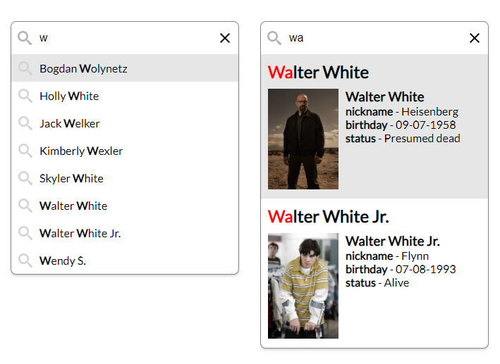

<h1 align="center">
  Autocomplete
</h1>

<p align="center">
  Simple autocomplete with asynchronous data fetch
</p>

<p align="center">
  
  
  <a href="LICENSE">
    
  </a>
</p>

<p align="center">
  
</p>

## Demo

See the demo - [example](https://tomickigrzegorz.github.io/autocomplete/)

## Select2 replacement

This library can serve as a lightweight, zero-dependency alternative to **jQuery Select2**. Using `dropdownParent`, `showValuesOnClick` and `classPrefix` you can build fully custom select components — including flag-based country selectors and multi-select with chip tags — without pulling in jQuery or any extra dependencies.

See the live examples:
- [Country selector](https://tomickigrzegorz.github.io/autocomplete/#country-select-example) — single-select with flag icons
- [Country selector multi](https://tomickigrzegorz.github.io/autocomplete/#country-select-multi-example) — multi-select with chips, configurable limit and deselect on click

## Features

- You're in full control of the DOM elements to output
- Accessible, with full support for ARIA attributes and keyboard interactions
- Customize your own CSS
- Support for asynchronous data fetching
- Move between the records using the arrows <kbd>↓</kbd> <kbd>↑</kbd>, and confirm by <kbd>Enter</kbd> or mouse
- Grouping of record results
- Showing 'no results'
- Show all values on click
- Multiple choices
- **Select2 alternative** — build custom searchable selects with flags, chips and multi-select without jQuery
- No dependencies
- Very light library, packed gzip **only ~4KB**
- And a lot more

## Installation

### Using npm

Install the library via npm:

```bash
npm install @tomickigrzegorz/autocomplete
```

Or using Yarn:

```bash
yarn add @tomickigrzegorz/autocomplete
```

### Import via ES module

After installing via npm or Yarn you can import the library as an ES module:

```js
import Autocomplete from '@tomickigrzegorz/autocomplete';
import '@tomickigrzegorz/autocomplete/css';
```

Or import CSS separately using the full path:

```js
import 'node_modules/@tomickigrzegorz/autocomplete/dist/css/autocomplete.min.css';
```

### Using a CDN

#### CSS

```html
<link rel="stylesheet" href="https://cdn.jsdelivr.net/gh/tomickigrzegorz/autocomplete@3.2.0/dist/css/autocomplete.min.css"/>
```

#### JavaScript

```html
<script src="https://cdn.jsdelivr.net/gh/tomickigrzegorz/autocomplete@3.2.0/dist/js/autocomplete.min.js"></script>
```

##### -- OR --

Download from `dist` folder and insert to HTML:

- `dist/css/autocomplete.css`
- `dist/js/autocomplete.min.js`

#### HTML

Basic code to display autocomplete correctly

```html
<div class="auto-search-wrapper">
  <input type="text" id="local" autocomplete="off" placeholder="Enter letter" />
</div>
```

#### JavaScript

```js
window.addEventListener('DOMContentLoaded', function () {
  // 'local' is the 'id' of input element
  new Autocomplete('local', {
    onSearch: ({ currentValue }) => {
      // local data
      const data = [
        { name: 'Walter White' },
        { name: 'Jesse Pinkman' },
        { name: 'Skyler White' },
        { name: 'Walter White Jr.' },
      ];
      return data
        .sort((a, b) => a.name.localeCompare(b.name))
        .filter((element) => {
          return element.name.match(new RegExp(currentValue, 'i'));
        });
    },

    onResults: ({ matches }) => {
      return matches
        .map((el) => {
          return `
            <li>${el.name}</li>`;
        })
        .join('');
    },
  });
});
```

## Package Manager

Before the first use, clone this repository and install node dependencies:

```js
git clone https://github.com/tomickigrzegorz/autocomplete.git

yarn
// or
npm install
```

## Run the app

Run the development version:

```js
yarn dev
// or
npm run dev
```

Run the production version:

```js
yarn prod
// or
npm run prod
```

## Configuration of the plugin

| props                |    type    |               default               | require | description                                                                                                                                                              |
| -------------------- | :--------: | :---------------------------------: | :-----: | ------------------------------------------------------------------------------------------------------------------------------------------------------------------------ |
| element              |   string   |                                     |    ✔    | Input field id                                                                                                                                                           |
| onSearch             |  function  |                                     |    ✔    | Function for user input. It can be a synchronous function or a promise                                                                                                   |
| onResults            |  function  |                                     |    ✔    | Function that creates the appearance of the result                                                                                                                       |
| onSubmit             |  function  |                                     |         | Executed on input submission                                                                                                                                             |
| onOpened             |  function  |                                     |         | returns two variables 'results' and 'showItems', 'resutls' first rendering of the results 'showItems' only showing the results when clicking on the input field          |
| onSelectedItem       |  function  |                                     |         | Get index and data from li element after hovering over li with the mouse or using arrow keys ↓/↑                                                                         |
| onReset              |  function  |                                     |         | After clicking the 'x' button                                                                                                                                            |
| onRender             |  function  |                                     |         | Possibility to add html elements, e.g. before and after the search results                                                                                               |
| onClose              |  function  |                                     |         | e.g. delete class after close results, see example modal                                                                                                                 |
| noResults            |  function  |                                     |         | Called when no results are found. Return an HTML string to display: `noResults: ({ currentValue }) => \`<li>No results for "${currentValue}"</li>\`` |
| destroy              |   method   |                                     |         | Clears the input and removes all event listeners. Use `reset()` if you want to keep the autocomplete functional                                                          |
| reset               |   method   |                                     |         | Clears the input and closes the results list while keeping all event listeners active. Safe alternative to `destroy()` when you just want to clear the field             |
| rerender             |   method   |                                     |         | This method allows you to re-render the results without modifying the input field. Of course, we can also send the string we want to search for to the method. render(string);                                                                                                                       |
| disable             |   method   |                                     |         | This method allows you to disable the autocomplete functionality. `const auto = new Autocomplete('id', {...});` `auto.disable();` then we disable the autocomplete. To remove input value you need to call `auto.disable(true);`                                                                                                                       |
| enable              |   method   |                                     |         | This method allows you to re-enable the autocomplete functionality after it has been disabled. `const auto = new Autocomplete('id', {...});` `auto.disable();` `auto.enable();` - now the autocomplete is active again and all event listeners are restored                                                                                                                       |
| clearButton          |  boolean   |               `true`                |         | A parameter set to 'true' adds a button to remove text from the input field                                                                                              |GitHub Markdown Preview
| clearButtonOnInitial |  boolean   |               `false`               |         | A parameter set to 'true' adds a button to remove text from the input field visible on initial Autocomplete lib.                                                         |
| selectFirst          |  boolean   |               `false`               |         | Default selects the first item in the list of results                                                                                                                    |
| insertToInput        |  boolean   |               `false`               |         | Adding an element selected with arrows or hovering with the mouse to the input field                                                                                                                |
| disableCloseOnSelect |  boolean   |               `false`               |         | Prevents results from hiding after clicking on an item from the results list                                                                                             |
| preventScrollUp      |  boolean   |               `false`               |         | The parameter prevents the results from scrolling up when scrolling after reopening the results. The results are displayed in the same place. The selected item does not disappear and is still selected.                                                                                             |
| showAllValuesOnClick |  boolean   |               `false`               |         | This option will toggle showing all values when the input is clicked, like a default dropdown                                                                            |
| inline        |  boolean   |               `false`               |         | This option displays all results without clicking on the input field                                                                            |
| removeResultsWhenInputIsEmpty        |  boolean   |               `false`               |         | Set to `true` to clear the results when the input is empty                                                                                                              |
| cache                |  boolean   |               `false`               |         | The characters entered in the input field are cached                                                                                                                     |
| regex        |  object   |  `{ expression: /[\|\\{}()[\]^$+*?]/g, replacement: "\\$&" }`  |         | the parameter allows you modify string before search. For example, we can remove special characters from the string. Default value is object `{ expression: /[\|\\{}()[\]^$+*?]/g, replacement: "\\$&" }` You can add only `expression` or only `replacement`. |
| howManyCharacters    |   number   |                 `1`                 |         | The number of characters entered should start searching                                                                                                                  |
| delay                |   number   |                `500`                |         | Time in milliseconds that the component should wait after last keystroke before calling search function 1000 = 1s                                                        |
| ariaLabelClear       |   string   |        `clear the search query.`      |         | Set aria-label attribute for the clear button |
| classPreventClosing  |   string   |                                     |         | Prevents results from hiding after clicking on element with this class                                                                                                   |
| classGroup           |   string   |                                     |         | Enter a class name, this class will be added to the group name elements                                                                                                  |
| classPrefix          |   string   |                                     |         | Prefixing all autocomplete css class name, 'prefix-auto-', default 'auto-'                                                                                               |
| dropdownParent       | string/Element |            `null`               |         | Appends the dropdown to the specified element instead of next to the input. Accepts a CSS selector string or an `HTMLElement`. Use `document.body` to escape `overflow` clipping in modals or fixed-height containers. |

**instructions** - has been removed from the library, [see how to add to html](https://tomickigrzegorz.github.io/autocomplete/#complex-example)

## How do I add data to the input field?

### Simple data

```js
onResults: ({ matches }) => {
  return matches
    .map((el) => {
      return `
        <li>${el.name}</li>`;
    })
    .join('');
};
```

### A complicated example

The example below displays `${el.name}`, first name and last name as well as `${el.img}` photo in the results. From this example, only the first element will be added to the input field. So `${el.name}` no matter if it will be inside `p`, `div`, `span` etc. Always the first element and it's only text so it can even be in this form `<p><b>${el.name}</b></p>`

```js
onResults: ({ matches }) => {
  return matches
    .map((el) => {
      return `
        <li>
          <p>${el.name}</p>
          <p></p>
        </li>`;
    })
    .join('');
};
```

## Usage jquery || axios || promise + fetch

JAVASCRIPT

```js
new Autocomplete('complex', {
  // search delay
  delay: 1000,

  // add button 'x' to clear the text from
  // the input filed
  // by default is true
  clearButton: true,

  // show button 'x' to clear the text from
  // the input filed on initial library
  clearButtonOnInitial: false,

  // default selects the first item in
  // the list of results
  // by default is false
  selectFirst: false,

  // add text to the input field as you move through
  // the results with the up/down cursors
  // by default is false
  insertToInput: false,

  // the number of characters entered
  // should start searching
  // by default is 1
  howManyCharacters: 1,

  // the characters entered in
  // the input field are cached
  // by default is false
  cache: false,

  // prevents results from hiding after
  // clicking on an item from the list
  // by default is false
  disableCloseOnSelect: false,

  // enter the name of the class by
  // which you will name the group element
  // by default is empty ''
  classGroup: 'group-by',

  // prevents results from hiding after
  // clicking on element with this class
  // of course, any class name
  // by default is empty ''
  classPreventClosing: 'additional-elements',

  // prefixing all autocomplete css class name,
  // 'prefix-auto-', default 'auto-'
  classPrefix: 'prefix',

  // this option will toggle showing all
  // values when the input is clicked,
  // like a default dropdown
  // by default is false
  showAllValuesOnClick: false,

  // this option displays all results
  // without clicking on the input field
  inline: false,

  // set aria-label attribute for the clear button
  // by default is 'clear text from input'
  ariaLabelClear: 'insert your text if you want ;)'

  // parameter prevents the results from scrolling 
  // up when we have scrolling. It also works when we
  // click a second time when we have results. 
  // The results are shown in the same place.
  preventScrollUp: false,

  // set to true deletes the results when input is empty.
  // We use the `destroy()` method which removes the
  // results from the DOM and returns everything to its
  // original state
  removeResultsWhenInputIsEmpty: false,

  // appends the dropdown to the specified element instead
  // of next to the input. Accepts a CSS selector string
  // or an HTMLElement — useful to escape overflow clipping
  // in modals or fixed-height containers.
  // by default is null
  dropdownParent: document.body,

  // parameter allows you modify string before search.
  // For example, we can remove special characters from
  // the string. Default value is object
  // `{ expression: /[|\\{}()[\]^$+*?]/g, replacement: "\\$&" }`
  // You can add only `expression` or only `replacement`.
  regex: { expression: /[\|\\{}()[\]^$+*?]/g, replacement: "\\$&" },

  // Function for user input. It can be a synchronous function or a promise
  // you can fetch data with jquery, axios, fetch, etc.
  onSearch: ({ currentValue }) => {
    // static file
    // const api = './characters.json';

    // OR -------------------------------

    // your REST API
    const api = `https://rickandmortyapi.com/api/character?name=${encodeURI(currentValue)}`;
    /**
     * jquery
     * If you want to use jquery you have to add the
     * jquery library to head html
     * https://cdnjs.com/libraries/jquery
     */
    return $.ajax({
      url: api,
      method: 'GET',
    })
      .done(function (data) {
        return data.results;
      })
      .fail(function (xhr) {
        console.error(xhr);
      });

    // OR ----------------------------------

    /**
     * axios
     * If you want to use axios you have to add the
     * axios library to head html
     * https://cdnjs.com/libraries/axios
     */
    return axios
      .get(api)
      .then((response) => {
        return response.data.results;
      })
      .catch((error) => {
        console.log(error);
      });

    // OR ----------------------------------

    /**
     * Promise
     */
    return new Promise((resolve) => {
      fetch(api)
        .then((response) => response.json())
        .then((data) => {
          resolve(data.results);
        })
        .catch((error) => {
          console.error(error);
        });
    });
  },

  // this part is responsible for the number of records,
  // the appearance of li elements and it really depends
  // on you how it will look
  onResults: ({ currentValue, matches, classGroup }) => {
    // const regex = new RegExp(^${input}`, 'gi'); // start with
    const regex = new RegExp(currentValue, 'gi');

    // counting status elements
    function count(status) {
      let count = {};
      matches.map((el) => {
        count[el.status] = (count[el.status] || 0) + 1;
      });
      return `<small>${count[status]} items</small>`;
    }

    return matches
          .sort(
            (a, b) =>
              a.status.localeCompare(b.status) || a.name.localeCompare(b.name)
          )
          .map((el, index, array) => {
            // we create an element of the group
            let group =
              el.status !== array[index - 1]?.status
                ? `<li class="${classGroup}">${el.status} ${count(el.status)}</li>`
                : '';

            // this part is responsible for the appearance
            // in the drop-down list - see the example in index.html
            // remember only the first element from <li> is put
            // into the input field, in this case the text
            // from the <p> element
            return `
              ${group}
              <li>
                <h2 style="margin-bottom: 10px;">
                  ${el.name.replace(regex, (str) => `<b style="color: red;">${str}</b>`)}
                </h2>
                <div style="display: flex;">
                  <div style="margin-right: 10px;">
                    
                  </div>
                  <div class="info">
                    <h4>${el.name}</h4>
                    <div><b>gender:</b> - ${el.gender}</div>
                    <div><b>species:</b> - ${el.species}</div>
                    <div><b>status:</b> - ${el.status}</div>
                  </div>
                </div>
              </li>`;
          })
          .join('');
  },

  // the onSubmit function is executed when the user
  // submits their result by either selecting a result
  // from the list, or pressing enter or mouse button
  onSubmit: ({ index, element, object, results }) => {
    console.log('complex: ', index, element, object, results);
    // window.open(`https://www.imdb.com/find?q=${encodeURI(input)}`)
  },

  // get index and data from li element after
  // hovering over li with the mouse or using
  // arrow keys ↓ | ↑
  onSelectedItem: ({ index, element, object, currentValue }) => {
    console.log('onSelectedItem:', index, element.value, object);
  },

  // the callback presents no results
  noResults: ({ currentValue }) =>
    `<li>No results found: "${currentValue}"</li>`,
});
```

## All available configuration items

```js
const auto = new Autocomplete('you-id', {
  clearButton: true,
  clearButtonOnInitial: false,
  selectFirst: false,
  insertToInput: false,
  disableCloseOnSelect: false,
  cache: false,
  showAllValuesOnClick: false,
  inline: false,
  howManyCharacters: 1,
  preventScrollUp: false,
  delay: 500,
  ariaLabelClear: "clear the search query",
  regex: { expression: /[\|\\{}()[\]^$+*?]/g, replacement: "\\$&" },
  removeResultsWhenInputIsEmpty: false,
  dropdownParent: null, // string (CSS selector) or HTMLElement
  classPreventClosing: "", // don't use empty value
  classGroup: "", // don't use empty value
  classPrefix: "", // don't use empty value
  onSearch: ({ currentValue, element }) => {},
  onResults: ({ currentValue, matches, classGroup }) => {},
  onRender: ({ element, results }) => {},
  onSubmit: ({ index, element, object, results }) => {},
  onOpened: ({ type, element, results }) => {},
  onSelectedItem: ({ index, element, object, currentValue }) => {},
  onReset: (element) => {},
  onClose: () => {},
  noResults: ({ element, currentValue }) => {},
});

// public methods
auto.destroy(); // clear input and remove all event listeners
auto.reset();   // clear input and close results, keeps listeners active
auto.disable(); // disable autocomplete
auto.disable(true); // disable autocomplete and clear input value
auto.enable(); // enable autocomplete after it was disabled
auto.rerender(); // re-render the results
// pass string to search
auto.rerender(string);
```

### Enable/Disable Example

The `enable()` method safely restores autocomplete functionality without automatically triggering search results:

```js
const auto = new Autocomplete('input', {
  onSearch: ({ currentValue }) => {
    // your search logic
    return data.filter(item => item.name.includes(currentValue));
  }
});

// Disable autocomplete
auto.disable();

// Re-enable autocomplete - this will NOT trigger search automatically
// even if the input field is empty or has some text
auto.enable();

// After enable(), autocomplete will work normally:
// - User needs to type (respecting howManyCharacters setting)
// - OR click input (if showAllValuesOnClick: true)
// - OR call auto.rerender() to trigger search programmatically
```

**Important**: `enable()` only restores event listeners and functionality. It doesn't automatically show results. Search is triggered only by:
- User input (when `howManyCharacters` threshold is met)
- Input click (when `showAllValuesOnClick: true`)
- Manual `rerender()` call

### reset() vs destroy()

| Method | Clears input | Closes dropdown | Removes listeners | When to use |
|--------|-------------|-----------------|-------------------|-------------|
| `reset()` | ✅ | ✅ | ❌ | Clear button, external "clear" action — autocomplete stays functional |
| `destroy()` | ✅ | ✅ | ✅ | Permanent teardown — e.g. closing a modal with `dropdownParent` |

```js
// External clear button — use reset()
document.querySelector('.clear-btn').addEventListener('click', () => {
  auto.reset();
});

// Modal close — use destroy() to clean up resultWrap from document.body
modalCloseBtn.addEventListener('click', () => {
  modal.style.display = 'none';
  auto.destroy();
});
```

## License

This project is available under the [MIT](https://opensource.org/licenses/mit-license.php) license.
